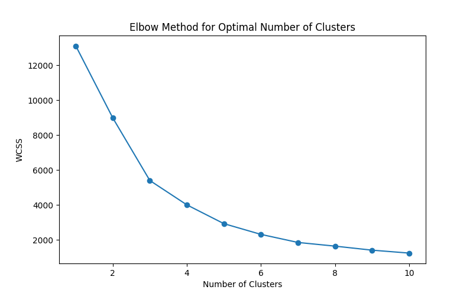
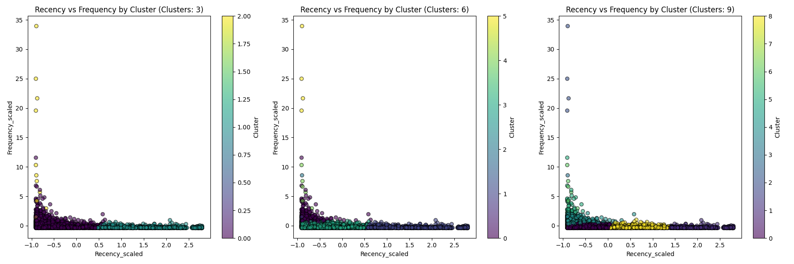
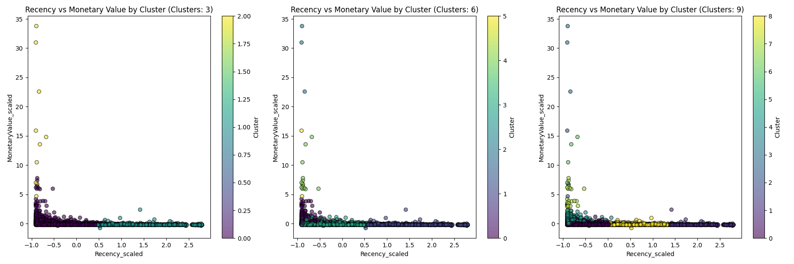
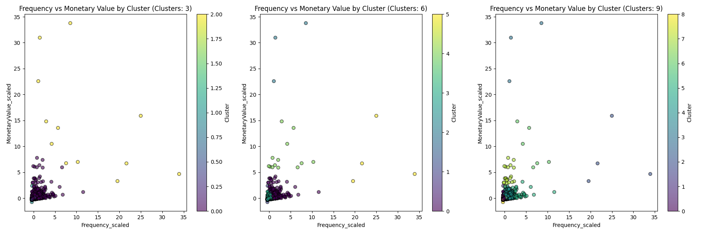
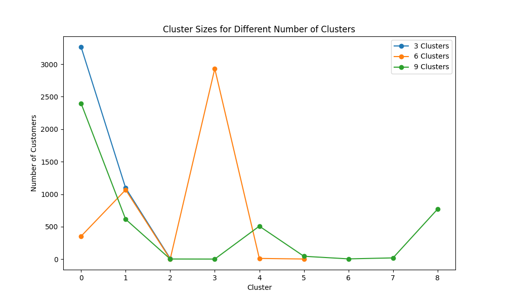

# Customer Segmentation Analysis

## 1. Data Collection
- **Obtain the Dataset:** Download the dataset from a reliable source (e.g., Retail Data Analytics). Ensure the dataset covers transactions from 01/12/2010 to 09/12/2011 for a UK-based online retailer.

## 2. Data Preparation
### Summary of Execution:
- **Initial Data Load:**
  - Successfully loaded the dataset with 541,909 records.
- **Data Cleaning:**
  - Dropped rows with missing values in critical columns, resulting in 406,829 records.
  - Handled missing descriptions and converted `InvoiceDate` to datetime format.
- **RFM Metrics Calculation:**
  - Calculated Recency, Frequency, and Monetary Value metrics.
  - Generated an RFM DataFrame with 4,372 unique customers.
- **Normalization:**
  - Applied `StandardScaler` to normalize RFM features.
  - Saved the normalized RFM data to `data/rfm_clusters.csv`.

## 3. Implement K-Means Clustering
### Results Summary

#### 1. Clustering with 3 Clusters
- **Cluster Sizes:**

| Cluster | Number of Customers |
|---------|----------------------|
| 0       | 3,264                |
| 1       | 1,096                |
| 2       | 12                   |

- **Summary Statistics:**

| Cluster | Recency_scaled | Frequency_scaled | MonetaryValue_scaled |
|---------|----------------|------------------|-----------------------|
| 0       | High           | Low              | Low                   |
| 1       | Intermediate   | Intermediate     | Negative               |
| 2       | Low            | High             | Very High             |

- **Cluster Centroids:**

| Centroid | Recency_scaled | Frequency_scaled | MonetaryValue_scaled |
|----------|----------------|------------------|-----------------------|
| 0        | Low            | Moderate         | Slightly Positive     |
| 1        | High           | Low              | Negative              |
| 2        | Low            | High             | Very High             |

- **Evaluation Metrics:**
  - **Silhouette Score:** 0.600 (good clustering)
  - **Davies-Bouldin Index:** 0.729 (moderate clustering quality)
  - **Within-Cluster Sum of Squares (WCSS):** 5,408.41

#### 2. Clustering with 6 Clusters
- **Cluster Sizes:**

| Cluster | Number of Customers |
|---------|----------------------|
| 0       | 354                  |
| 1       | 1,068                |
| 2       | 3                    |
| 3       | 2,930                |
| 4       | 13                   |
| 5       | 4                    |

- **Summary Statistics:**

| Cluster | Recency_scaled | Frequency_scaled | MonetaryValue_scaled |
|---------|----------------|------------------|-----------------------|
| 0       | Low            | High             | Moderate              |
| 1       | High           | Low              | Negative              |
| 2       | Low            | Very High        | Very High             |
| 3       | Low            | Moderate         | Slightly Negative     |
| 4       | Intermediate   | Moderate         | Moderate              |
| 5       | Low            | High             | Low                   |

- **Cluster Centroids:**

| Centroid | Recency_scaled | Frequency_scaled | MonetaryValue_scaled |
|----------|----------------|------------------|-----------------------|
| 0        | Low            | High             | Moderate              |
| 1        | High           | Low              | Negative              |
| 2        | Low            | Very High        | Very High             |
| 3        | Low            | Moderate         | Slightly Negative     |
| 4        | Intermediate   | Moderate         | Moderate              |
| 5        | Low            | High             | Low                   |

- **Evaluation Metrics:**
  - **Silhouette Score:** 0.589 (good clustering)
  - **Davies-Bouldin Index:** 0.628 (moderate clustering quality)
  - **Within-Cluster Sum of Squares (WCSS):** 2,323.54

#### 3. Clustering with 9 Clusters
- **Cluster Sizes:**

| Cluster | Number of Customers |
|---------|----------------------|
| 0       | 2,397                |
| 1       | 615                  |
| 2       | 4                    |
| 3       | 3                    |
| 4       | 509                  |
| 5       | 46                   |
| 6       | 6                    |
| 7       | 21                   |
| 8       | 771                  |

- **Summary Statistics:**

| Cluster | Recency_scaled | Frequency_scaled | MonetaryValue_scaled |
|---------|----------------|------------------|-----------------------|
| 0       | Moderate       | Moderate         | Moderate              |
| 1       | Higher         | Moderate         | Moderate              |
| 2       | Very High      | Very High        | Very High             |
| 3       | Unique         | Very High        | Very High             |
| 4       | Intermediate   | Some Variation    | Intermediate          |
| 5       | Lower          | Lower            | Lower                 |
| 6       | Moderate       | High             | Moderate              |
| 7       | High           | Lower            | Moderate              |
| 8       | Intermediate   | High             | Moderate              |

- **Cluster Centroids:**

| Centroid | Recency_scaled | Frequency_scaled | MonetaryValue_scaled |
|----------|----------------|------------------|-----------------------|
| 0        | Low            | Low              | Slightly Negative     |
| 1        | High           | Low              | Negative              |
| 2        | Low            | Very High        | High                  |
| 3        | Low            | Moderate         | Very High             |
| 4        | Intermediate   | Moderate         | Moderate              |
| 5        | Low            | High             | Low                   |
| 6        | Low            | Moderate         | Moderate              |
| 7        | High           | Lower            | Moderate              |
| 8        | Low            | High             | Moderate              |

- **Evaluation Metrics:**
  - **Silhouette Score:** 0.509 (good clustering)
  - **Davies-Bouldin Index:** 0.672 (moderate clustering quality)
  - **Within-Cluster Sum of Squares (WCSS):** 1,420.46

## 4. Data Visualization
### Summary of Each Plot

- **Elbow Method Plot:**
  - **Description:** Displays the relationship between the number of clusters and the Within-Cluster Sum of Squares (WCSS).
  - **Purpose:** Helps identify the optimal number of clusters by looking for the "elbow" point where adding more clusters yields a diminishing return in WCSS reduction.
  - **File:** 

- **Recency vs Frequency Scatter Plots:**
  - **Description:** Shows scatter plots of Recency vs Frequency for 3, 6, and 9 clusters, with points colored by cluster assignment.
  - **Purpose:** Visualizes how different clusters are distributed in terms of Recency and Frequency.
  - **File:** 

- **Recency vs Monetary Value Scatter Plots:**
  - **Description:** Shows scatter plots of Recency vs Monetary Value for 3, 6, and 9 clusters, with points colored by cluster assignment.
  - **Purpose:** Visualizes how different clusters are distributed in terms of Recency and Monetary Value.
  - **File:** 

- **Frequency vs Monetary Value Scatter Plots:**
  - **Description:** Shows scatter plots of Frequency vs Monetary Value for 3, 6, and 9 clusters, with points colored by cluster assignment.
  - **Purpose:** Visualizes how different clusters are distributed in terms of Frequency and Monetary Value.
  - **File:** 

- **Cluster Sizes Comparison Plot:**
  - **Description:** Displays the number of customers in each cluster for 3, 6, and 9 clusters.
  - **Purpose:** Compares the sizes of clusters across different cluster configurations to understand the distribution of data points among clusters.
  - **File:** 

### Recommendations
- Use the 3-cluster solution for a high-level overview and easier interpretation.
- For more detailed analysis, consider the 6-cluster solution which provides more granular insights into customer segments.
- Evaluate additional clustering methods or parameters if necessary to refine the analysis further.
