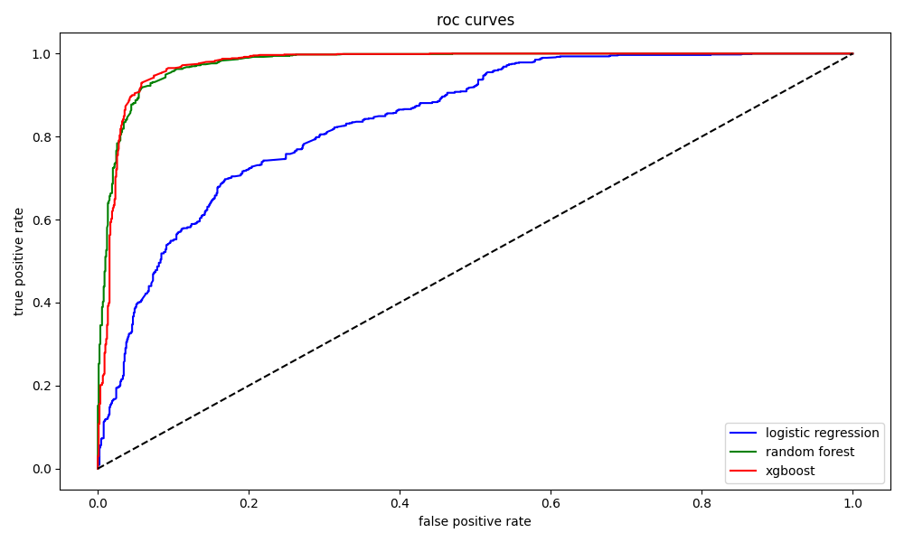
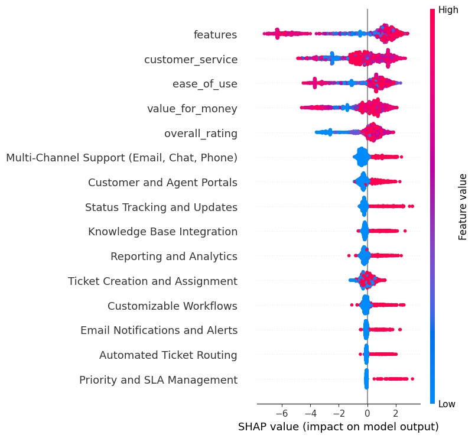
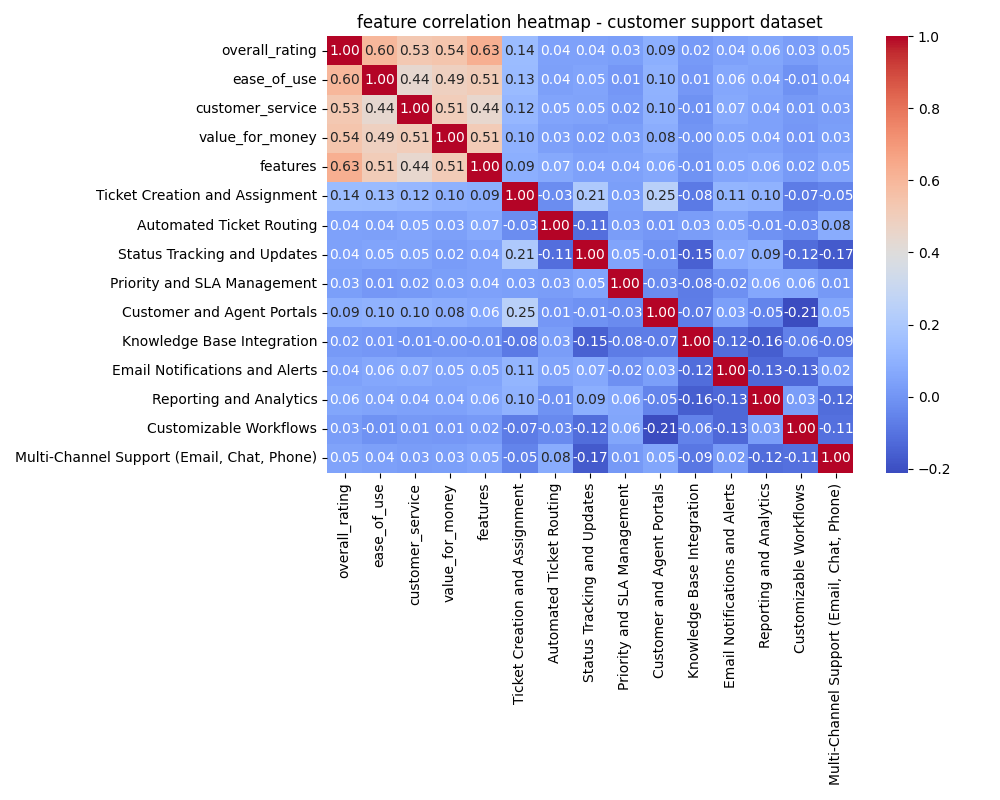
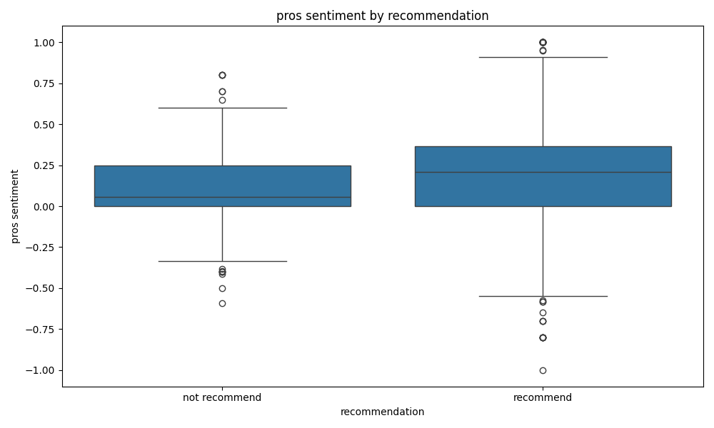
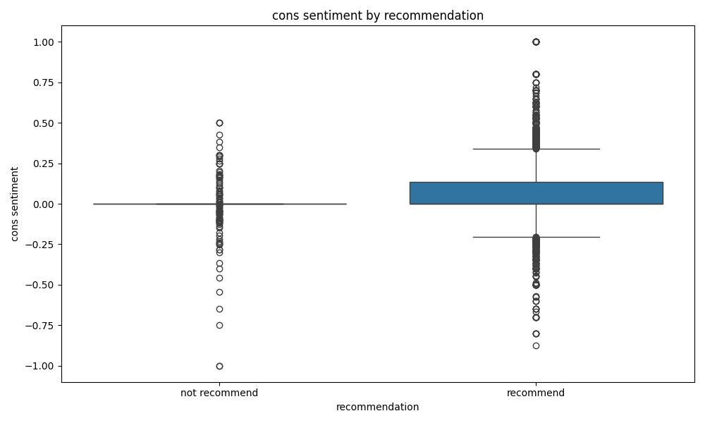
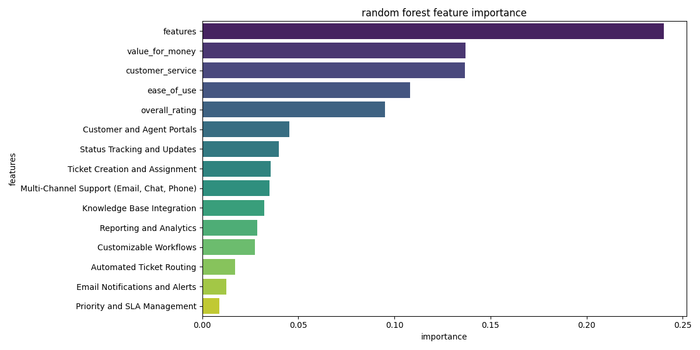
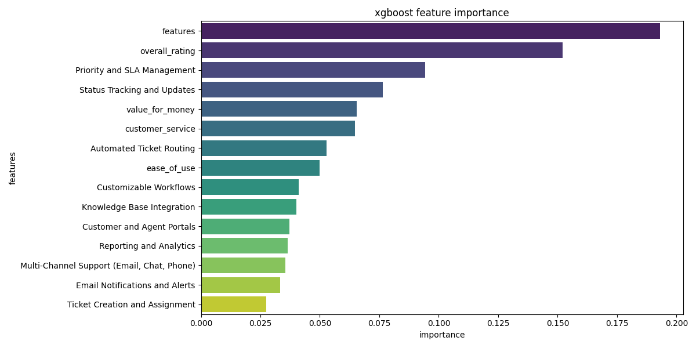
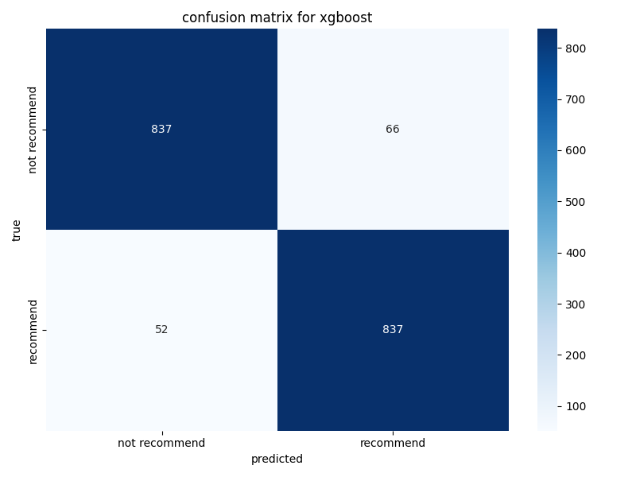

# Customer Support Flow Analysis

## 1. Data Collection
- **Dataset Acquisition:** Obtain customer support ticket data from a reliable source. The dataset should include relevant columns like `ticket_id`, `created_time`, `closed_time`, `assigned_agent`, `escalated`, `resolved_within_sla`, `issue_type`, and feedback columns such as `pros_text` and `cons_text`.

## 2. Data Preparation
### Execution Summary:
- **Data Loading:**
  - The dataset was successfully loaded, containing both customer feedback and ticket resolution information.
- **Data Cleaning:**
  - Missing values in numeric columns like `ease_of_use`, `customer_service`, `value_for_money`, and `features` were replaced with mean values.
  - Empty text feedback fields (`pros_text` and `cons_text`) were populated with the placeholder "No feedback".
  - Rows with missing values in the target column (`likelihood_to_recommend`) were dropped to ensure model reliability.
- **Feature Engineering:**
  - A new binary variable (`recommend_flag`) was created to indicate whether a customer would recommend the product, based on the `likelihood_to_recommend` score.

## 3. Model Implementation
### Model Training Overview:
- **Logistic Regression:**
  - This model aimed to predict customer recommendation likelihood based on various features like customer service, ease of use, etc.
  - The model achieved a **ROC AUC** score of 0.84, with balanced precision and recall for both positive and negative classes.

- **Random Forest Classifier:**
  - Hyperparameters were optimized using cross-validation.
  - The model achieved a **ROC AUC** score of 0.98, reflecting excellent performance with high precision and recall across both classes.

- **XGBoost Classifier:**
  - Similar to the Random Forest model, XGBoost achieved a **ROC AUC** score of 0.98, proving its ability to handle large datasets effectively while maintaining strong performance.

### Model Evaluation:
- **Logistic Regression:**
  - **Precision:** 0.75
  - **Recall:** 0.75
  - **F1-Score:** 0.75
  - **ROC AUC:** 0.84

- **Random Forest:**
  - **Precision:** 0.93
  - **Recall:** 0.93
  - **F1-Score:** 0.93
  - **ROC AUC:** 0.98

- **XGBoost:**
  - **Precision:** 0.93
  - **Recall:** 0.94
  - **F1-Score:** 0.93
  - **ROC AUC:** 0.98

## 4. Data Visualization
### Plot Overview and Discussion:

- **Logistic Regression ROC Curve:**
  - **Description:** The ROC curve for the Logistic Regression model illustrates its performance in distinguishing between positive and negative classes. The curve helps us understand how the model is doing at classifying the data, where the area under the curve (AUC) provides a measure of performance.
  - **Purpose:** Evaluates how well the model performs in distinguishing between the two classes.
  - 

- **Random Forest ROC Curve:**
  - **Description:** This ROC curve reflects the performance of the Random Forest model. The higher the curve, the better the model's ability to distinguish between positive and negative classes.
  - **Purpose:** Compares the Random Forest's performance with Logistic Regression. Given the higher AUC score, we can see that Random Forest is doing better in classifying the data.
  - 

- **XGBoost ROC Curve:**
  - **Description:** The ROC curve for XGBoost shows the model's ability to separate the classes. With its impressive performance, the model shows a strong ability to predict recommendations correctly.
  - **Purpose:** Similar to the other curves, it demonstrates XGBoost's performance, which is comparable to Random Forest.
  - 

- **SHAP Summary Plot:**
  - **Description:** This plot summarizes feature importance based on SHAP (SHapley Additive exPlanations) values. Each feature's importance is shown, which helps us interpret the model’s decisions and understand which features are most influential.
  - **Purpose:** It’s critical for understanding the factors that drive the predictions, like how customer service or product features might be affecting the likelihood of recommendation.
  - 

- **Feature Correlation Heatmap:**
  - **Description:** This heatmap displays the correlation between different features in the dataset. Strong correlations between features are visible here, which might indicate that certain features are linked in terms of customer satisfaction.
  - **Purpose:** This helps identify any relationships between features that could explain why customers recommend or don’t recommend a product.
  - 

- **Sentiment Analysis Boxplots:**
  - **Description:** These boxplots show sentiment analysis for both `pros_text` and `cons_text`, broken down by whether the customer recommended the product. Positive and negative sentiments are displayed for customers who are likely to recommend vs. those who are not.
  - **Purpose:** These visualizations help us understand how sentiment influences the decision to recommend a product. It shows that more positive feedback (pros) correlates with a higher likelihood to recommend.
  - 
  - 

- **Feature Importance Plot for Random Forest:**
  - **Description:** This plot shows the relative importance of each feature as determined by the Random Forest model. Features that are more important in predicting whether a customer recommends the product will appear higher in the plot.
  - **Purpose:** It helps to visualize which features the Random Forest model depends on most. For instance, customer service and product ease of use might rank high.
  - 

- **Feature Importance Plot for XGBoost:**
  - **Description:** Like the Random Forest plot, this one visualizes feature importance for the XGBoost model. It highlights which features contribute most to the prediction.
  - **Purpose:** Identifies the features that matter the most for XGBoost, offering another layer of understanding in model interpretability.
  - 

- **Confusion Matrix for XGBoost:**
  - **Description:** The confusion matrix shows how well the XGBoost model classifies the data, presenting true positives, false positives, true negatives, and false negatives.
  - **Purpose:** This helps evaluate the accuracy and reliability of the XGBoost model in predicting customer recommendations.
  - 

## 5. Conclusion
The **Customer Support Flow Analysis** project applies machine learning models like **Logistic Regression**, **Random Forest**, and **XGBoost** to predict customer recommendations. The results show that **Random Forest** and **XGBoost** perform exceptionally well, with **ROC AUC scores above 0.97**, while **Logistic Regression** provides a more interpretable yet simpler model.

- **Logistic Regression** offers a basic, interpretable approach with decent performance.
- **Random Forest** and **XGBoost** provide more advanced, accurate models with higher performance, especially in terms of ROC AUC scores.

By using **SHAP values**, we gained deeper insights into which features influence the predictions, and visualizations like **ROC curves** and **feature importance plots** further aided model interpretation.

### Key Insights:
- **Model Performance:** Random Forest and XGBoost demonstrated superior classification capabilities.
- **Feature Importance:** SHAP values helped us understand the critical features affecting recommendations.
- **Sentiment Analysis:** Revealed how sentiment in customer feedback affects the likelihood to recommend a product.

Future work could explore **social network analysis** and **process mining** to better understand ticket resolution workflows and agent dynamics.

## 6. Future Enhancements
- **Process Mining:** Discover ticket resolution workflows and pinpoint inefficiencies.
- **Social Network Analysis:** Investigate agent escalation paths and identify key influencers in customer support.
- **Deep Learning Models:** Explore deep learning techniques for even more accurate predictions.
