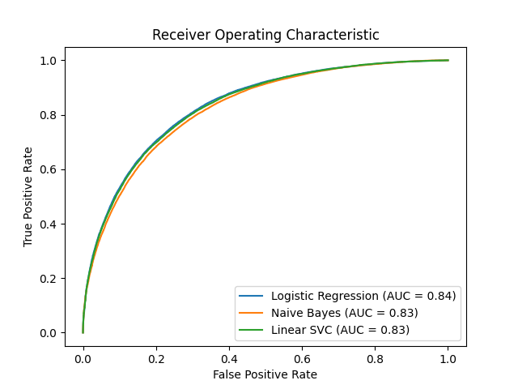
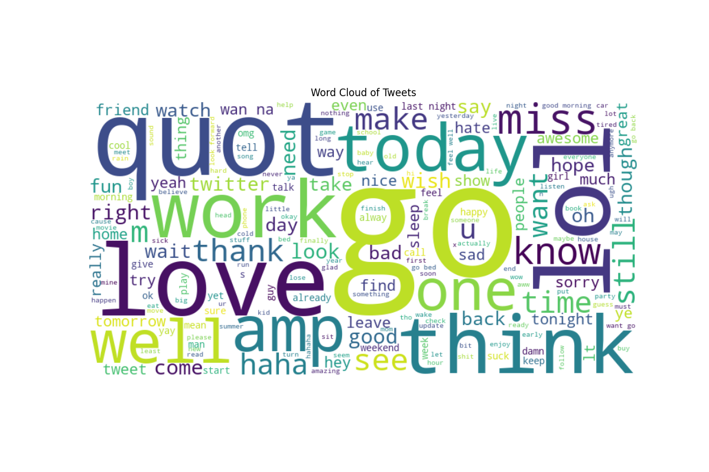

# Sentiment Analysis Project

## Overview

Sentiment analysis is a powerful tool for understanding opinions and emotions expressed in text. This project aims to develop a model to classify sentiment in text data, such as tweets or reviews, into positive, negative, or neutral categories. The project seeks to provide valuable insights into user sentiments and trends by leveraging machine learning techniques.

## Motivation

Understanding sentiment in text data can offer actionable insights for businesses, social media analysts, and researchers. This project aims to apply machine learning to sentiment analysis, enhancing the ability to categorize and interpret large volumes of text data efficiently.

## Requirements

1. **Data Collection and Preprocessing:**
   - **Dataset:** Sentiment140 in CSV format.
   - **Text Preprocessing:** Use NLTK and SpaCy for tasks including tokenization, normalization, stop word removal, and stemming/lemmatization.

2. **Feature Extraction:**
   - **Convert Text to Numerical Features:** Implement techniques like Bag of Words or TF-IDF using Python libraries.

## Model Evaluation

### Confusion Matrices

Confusion matrices for each model, showing true positives, true negatives, false positives, and false negatives:

>   

### ROC Curves

ROC curves for each model, demonstrating their ability to distinguish between classes. AUC scores indicate model performance:

>   

### Model Performance Summary

- **Logistic Regression:**  
  - Cross-Validation Accuracy: 0.7563  
  - Tuned Accuracy: 0.7560  
  - AUC: 0.84

- **Naive Bayes:**  
  - Cross-Validation Accuracy: 0.7444  
  - Tuned Accuracy: 0.7462  
  - AUC: 0.83

- **Linear SVC:**  
  - Cross-Validation Accuracy: 0.7518  
  - Tuned Accuracy: 0.7553  
  - AUC: 0.84

## Feature Analysis

### Feature Importances

Top features for each model are illustrated in the following plots:

- **Logistic Regression Top Features:**  
    

- **Naive Bayes Top Features:**  
  Description of top features with negative coefficients.

- **Linear SVC Top Features:**  
  Description of top features showing their importance.

## Visualization and Interpretation

### Word Cloud

Visualization of the most frequent words in the tweet text:

>   

### Top TF-IDF Scores

Bar chart showing the top TF-IDF scores for terms in the dataset:

>   

### Performance Metrics Comparison

Comparison of accuracy, precision, recall, and F1-score across models:

>   

## Challenges and Solutions

- **Challenge:** Handling imbalanced classes in the dataset.
  - **Solution:** Used stratified sampling and applied class weights to improve model performance.

- **Challenge:** Feature extraction from noisy text data.
  - **Solution:** Implemented advanced text preprocessing techniques to clean and normalize data effectively.

## Real-World Applications

The models and findings from this project can be applied in various domains, including:

- **Customer Sentiment Analysis:** Businesses can use sentiment analysis to gauge customer feedback and improve products/services.
- **Social Media Monitoring:** Analyze public sentiment on social media platforms to understand trends and user opinions.
- **Market Research:** Enhance market research efforts by analyzing sentiment trends and consumer behavior.

## Future Work and Improvements

Future work could include:

- Exploring additional features or models to improve classification performance.
- Conducting further hyperparameter tuning to optimize model performance.
- Analyzing sentiment trends over time or across different contexts.

## Summary

This sentiment analysis project involves loading and processing tweet data, training and evaluating various classification models, and analyzing the results through visualizations and feature importance. The models show competitive performance with opportunities for further enhancements.
