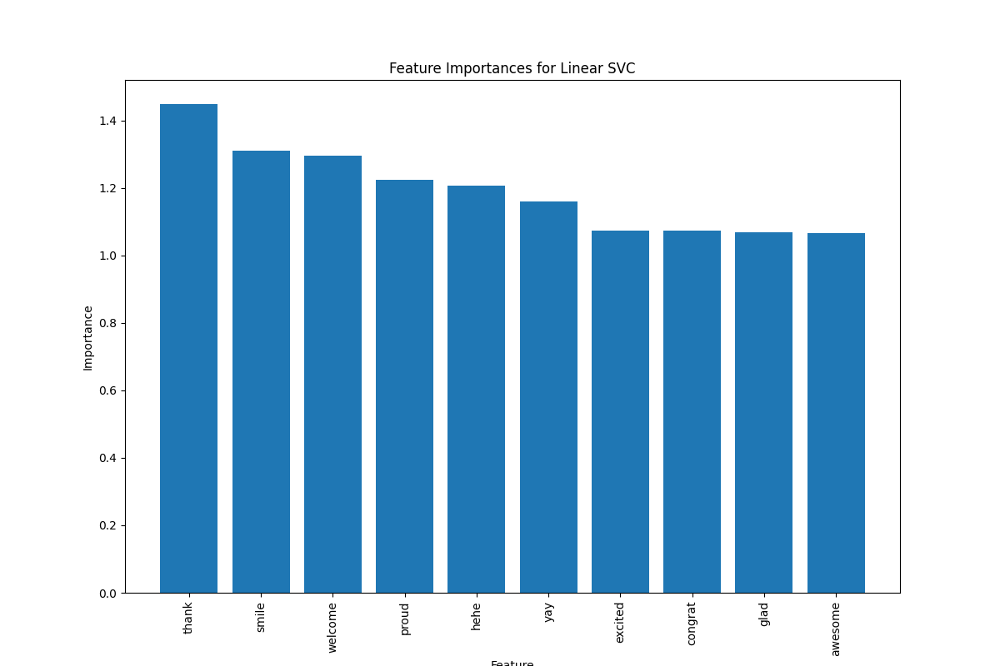

**Confusion Matrices:**

>   
> Confusion matrices for each model, showing true positives, true negatives, false positives, and false negatives.

**ROC Curves:**

>   
> ROC curves for each model, demonstrating their ability to distinguish between classes. AUC scores indicate model performance.

### Model Performance Summary

- **Logistic Regression:**  
  - Cross-Validation Accuracy: 0.7563  
  - Tuned Accuracy: 0.7560  
  - AUC: 0.84

- **Naive Bayes:**  
  - Cross-Validation Accuracy: 0.7444  
  - Tuned Accuracy: 0.7462  
  - AUC: 0.83

- **Linear SVC:**  
  - Cross-Validation Accuracy: 0.7518  
  - Tuned Accuracy: 0.7553  
  - AUC: 0.84

## Feature Analysis

**Feature Importances:**

> **Logistic Regression Top Features:**  
>   
> Bar charts showing the top 10 features for Logistic Regression.

> **Naive Bayes Top Features:**  
> Top features with negative coefficients.

> **Linear SVC Top Features:**  
> Top features showing their importance in the Linear SVC model.

## Visualization and Interpretation

**Word Cloud:**

>   
> Visualization of the most frequent words in the tweet text.

**Top TF-IDF Scores:**

>   
> Bar chart showing the top TF-IDF scores for terms in the dataset.

**Performance Metrics Comparison:**

>   
> Comparison of accuracy, precision, recall, and F1-score across the models.
